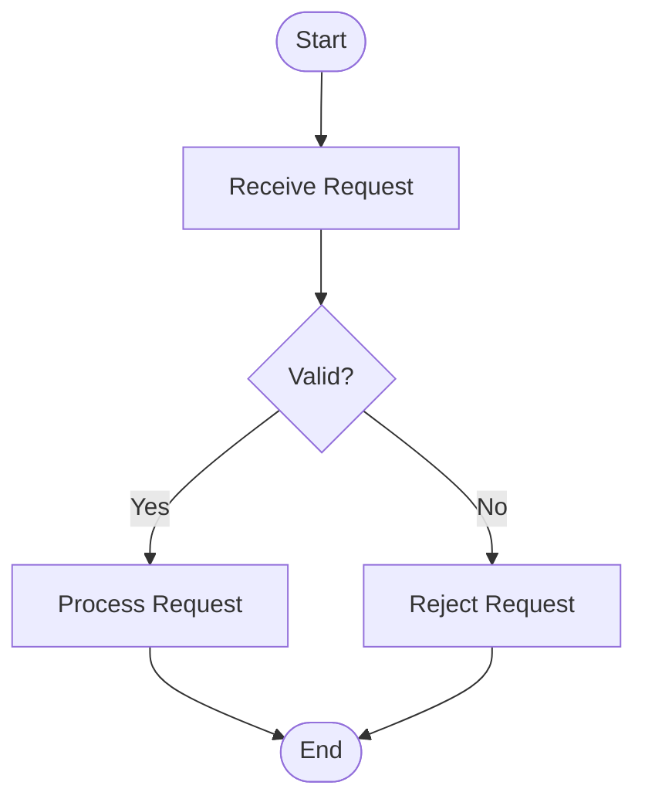

# sop-workflow-mermaid

**Authors:** Your Team

**Description:** Converts a Standard Operating Procedure (SOP) into a single high-level Mermaid Flowchart representing the complete business workflow. This skill is responsible only for workflow extraction and Mermaid diagram generation. It does **not** modify the repository, generate implementation code, or create rendered artifacts.

**Version:** 1.0

---

# Purpose

This skill transforms an SOP into a business-readable Mermaid workflow that can be consumed by downstream documentation or rendering tools.

The generated workflow should help users understand:

- Business process
- Workflow sequence
- Decision points
- Alternate paths
- Failure paths
- External system interactions
- Business actors (when documented)

This skill focuses exclusively on workflow visualization.

---

# Scope

This skill SHALL ONLY:

- Read the SOP.
- Analyze the documented workflow.
- Identify workflow sequence.
- Identify business actors.
- Identify participating systems.
- Identify business decisions.
- Identify alternate paths.
- Identify failure paths.
- Generate one Mermaid Flowchart.

This skill SHALL NOT:

- Generate implementation code.
- Generate test cases.
- Generate architecture documentation.
- Generate API documentation.
- Generate sequence diagrams.
- Generate class diagrams.
- Modify repository files.

---

# Inputs

## Required

- Standard Operating Procedure (SOP)

## Optional Reference

- Repository Documentation
- Knowledge Graph
- Existing Agent Skills

Reference documentation may only be used to clarify terminology.

The SOP remains the single source of truth.

---

# Repository Permissions

This skill follows a **strict read-only execution model**.

The repository must be treated as read-only at all times.

## Read Access

This skill MAY read:

- SOP documentation
- Repository documentation
- Knowledge Graph
- Existing Agent Skills
- Supporting Markdown documentation

These resources are used only to improve workflow understanding.

---

## Repository Protection

This skill MUST NOT:

- Create files
- Modify files
- Delete files
- Rename files
- Move files
- Generate repository artifacts
- Modify source code
- Modify configuration
- Modify documentation
- Modify prompts
- Modify Agent Skills
- Modify repository structure

No filesystem modifications are permitted.

---

# Workflow Generation Requirements

Generate exactly one Mermaid Flowchart using:

```mermaid
flowchart TD
```

The workflow must include, where documented:

- Start node
- End node
- Business process steps
- Decision nodes
- Success paths
- Failure paths
- Alternate paths
- External systems
- Business actors

The workflow should represent the SOP exactly as documented.

---

# Workflow Extraction Rules

Extract only information explicitly present within the SOP.

Never invent:

- Business rules
- Workflow steps
- Decision points
- Systems
- Actors
- Integrations
- Validation rules
- Exception paths

If information is not documented, omit it.

---

# Node Design Rules

Each process node MUST represent exactly one business action.

Decision nodes MUST contain exactly one business question.

Every node MUST contain meaningful visible text.

Good examples:

- Receive Customer Request
- Validate Portfolio Details
- Review Compliance Status
- Submit Approval Request
- Notify Customer
- Update CRM

Avoid generic labels such as:

- Process
- Step
- Action
- Task
- Validation

Never leave a node unlabeled.

Avoid implementation terminology including:

- Method names
- Class names
- API endpoints
- SQL queries
- Database operations
- Programming terminology

Use business language only.

---

# Decision Rules

Every documented business decision must include all documented outcomes.

Where applicable include:

- Yes path
- No path

If multiple outcomes exist, represent each documented outcome.

Do not invent undocumented branches.

---

# External Systems

Represent every documented external system as an independent node.

Examples:

- Salesforce
- CRM
- ERP
- Payment Gateway
- Notification Service
- Identity Provider

Do not merge systems into business actions.

---

# Flow Rules

The generated workflow must:

- Flow from top to bottom (`TD`)
- Preserve the documented workflow order
- Minimize crossing connectors
- Keep related branches together
- Merge branches only when documented
- Keep the workflow visually readable

---

# Mermaid Rules

Generate ONLY a Mermaid Flowchart.

Do NOT generate:

- Sequence Diagrams
- Class Diagrams
- ER Diagrams
- State Diagrams
- Gantt Charts
- Git Graphs
- Mind Maps
- User Journey Diagrams
- Pie Charts

The generated Mermaid must be compatible with:

- Mermaid v11
- GitHub Markdown
- VS Code Mermaid Preview

---

# Diagram Content Validation

Before returning the Mermaid diagram verify:

✓ Every node contains visible text.

✓ No node label is empty.

✓ No placeholder text exists.

✓ Every decision contains a business question.

✓ Every edge connects valid nodes.

✓ Every workflow step originates from the SOP.

✓ Every documented alternate path is represented.

✓ Every documented failure path is represented.

✓ External systems are represented where documented.

✓ No orphan nodes exist.

✓ Workflow order matches the SOP.

✓ Mermaid syntax is valid.

If any validation fails, regenerate the workflow instead of returning an incomplete diagram.

---

# Output

Return exactly one Mermaid Flowchart enclosed in a fenced Mermaid code block.

Example:

````text

